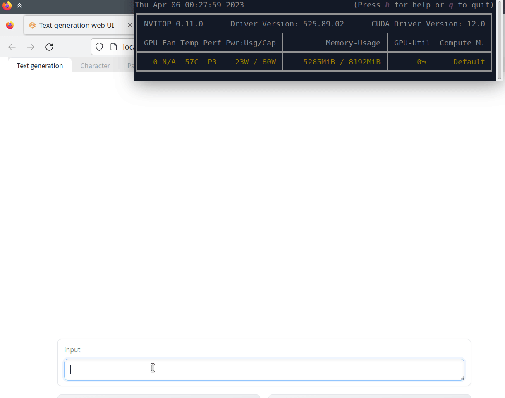

# Alpaca Lora 4bit
Made some adjust for the code in peft and gptq for llama, and make it possible for lora finetuning with a 4 bits base model. The same adjustment can be made for 2, 3 and 8 bits.

# Install Manual
```
git clone https://github.com/johnsmith0031/alpaca_lora_4bit.git
cd alpaca_lora_4bit
git fetch origin winglian-setup_pip
git checkout winglian-setup_pip
pip install .
```

To uninstall and reinstall, run:
```
cd alpaca_lora_4bit
pip uninstall alpaca_lora_4bit
pip uninstall alpaca_lora_4bit # uninstall again to ensure that you do not have another version
pip install .
```

For older cards that failed to compile:
```
git clone https://github.com/johnsmith0031/alpaca_lora_4bit.git
cd alpaca_lora_4bit
git fetch origin old_compatible
git checkout old_compatible
pip install .
```

# Docker

*note: Currently does not work*

## Quick start for running the chat UI

```
git clone https://github.com/johnsmith0031/alpaca_lora_4bit.git
cd alpaca_lora_4bit
DOCKER_BUILDKIT=1 docker build -t alpaca_lora_4bit . # build step can take 12 min
docker run --gpus=all -p 7860:7860 alpaca_lora_4bit
```
Point your browser to http://localhost:7860

## Results
It's fast on a 3070 Ti mobile.  Uses 5-6 GB of GPU RAM.



# Update Logs
* Resolved numerically unstable issue
* Reconstruct fp16 matrix from 4bit data and call torch.matmul largely increased the inference speed.
* Added install script for windows and linux.
* Added Gradient Checkpointing. Now It can finetune 30b model 4bit on a single GPU with 24G VRAM with Gradient Checkpointing enabled. (finetune.py updated) (but would reduce training speed, so if having enough VRAM this option is not needed)
* Added install manual by s4rduk4r
* Added pip install support by sterlind, preparing to merge changes upstream
* Added V2 model support (with groupsize, both inference + finetune)
* Added some options on finetune: set default to use eos_token instead of padding, add resume_checkpoint to continue training
* Added offload support. load_llama_model_4bit_low_ram_and_offload_to_cpu function can be used.
* Added monkey patch for text generation webui for fixing initial eos token issue.
* Added Flash attention support. (Use --flash-attention)
* Added Triton backend to support model using groupsize and act-order. (Use --backend=triton)
* Added g_idx support in cuda backend (need recompile cuda kernel)
* Added xformers support
* Removed triton, flash-atten from requirements.txt for compatibility
* Removed bitsandbytes from requirements
* Added pip installable branch based on winglian's PR
* Added Model server for better inference performance with webui (40% faster than original webui which runs model and gradio in same process)
* Added cuda backend quant attention and fused mlp from GPTQ_For_Llama.
* Added lora patch for GPTQ_For_Llama repo triton backend.
* Added support for llama2 GQA
* Added support for flash attention 2
* Updated install manual
* Changed block size from 256 to 128 to support more 4bit models<br>

# Finetune

After installation, this script can be used.

```
python finetune.py ./data.txt \
    --ds_type=txt \
    --lora_out_dir=./test/ \
    --llama_q4_config_dir=./llama-7b-4bit/ \
    --llama_q4_model=./llama-7b-4bit.pt \
    --mbatch_size=1 \
    --batch_size=1 \
    --epochs=3 \
    --lr=3e-4 \
    --cutoff_len=256 \
    --lora_r=8 \
    --lora_alpha=16 \
    --lora_dropout=0.05 \
    --warmup_steps=5 \
    --save_steps=50 \
    --save_total_limit=3 \
    --logging_steps=5 \
    --groupsize=128 \
    --xformers \
    --backend=cuda
```

# Inference

After installation, this script can be used:

```
python inference.py
```

# Text Generation Webui Monkey Patch

Clone the latest version of text generation webui and copy all the files into ./text-generation-webui/
```
git clone https://github.com/oobabooga/text-generation-webui.git
```

Open server.py and insert a line at the beginning
```
import custom_monkey_patch # apply monkey patch
...
```

Use the command to run

```
python server.py
```

## monkey patch inside webui

Currently the webui support using this repo by the monkeypatch inside it.<br>
You can simply clone this repo to ./repositories/ in the path of text generation webui.


# Flash Attention

Currently with flash attention 2 support, and directly use flash_attn_func function. Only support Llama / Llama 2 based model now.

* Just add --flash-attention to use it for finetuning.


# Xformers

* Install
```
pip install xformers
```

* Usage
```
from monkeypatch.llama_attn_hijack_xformers import hijack_llama_attention
hijack_llama_attention()
```

* add --xformers to use it for finetuning.

# Quant Attention and MLP Patch

Note: Currently does not support peft lora, but can use inject_lora_layers to load simple lora with only q_proj and v_proj.<br>

Usage:
```python
from model_attn_mlp_patch import make_quant_attn, make_fused_mlp, inject_lora_layers
make_quant_attn(model)
make_fused_mlp(model)

# Lora
inject_lora_layers(model, lora_path)
```

Only for faster lora:
```python
from monkeypatch.gptq_for_llala_lora_monkey_patch import inject_lora_layers
inject_lora_layers(model, lora_path, device, dtype)
```

# Model Server

Better inference performance with text_generation_webui, about <b>40% faster</b>

Simple expriment results:<br>
7b model with groupsize=128 no act-order<br>
improved from 13 tokens/sec to 20 tokens/sec

<b>Step:</b>
1. run model server process
2. run webui process with monkey patch

<b>Example</b>

run_server.sh
```
#!/bin/bash

export PYTHONPATH=$PYTHONPATH:./

CONFIG_PATH=
MODEL_PATH=
LORA_PATH=

VENV_PATH=
source $VENV_PATH/bin/activate
python ./scripts/run_server.py --config_path $CONFIG_PATH --model_path $MODEL_PATH --lora_path $LORA_PATH --groupsize=128 --quant_attn --port 5555 --pub_port 5556
```

run_webui.sh
```
#!/bin/bash

if [ -f "server2.py" ]; then
    rm server2.py
fi
echo "import custom_model_server_monkey_patch" > server2.py
cat server.py >> server2.py

export PYTHONPATH=$PYTHONPATH:../

VENV_PATH=
source $VENV_PATH/bin/activate
python server2.py --chat --listen
```

<b>Note:</b>
* quant_attn only support torch 2.0+
* lora support is only for simple lora with only q_proj and v_proj
* this patch breaks model selection, lora selection and training feature in webui
